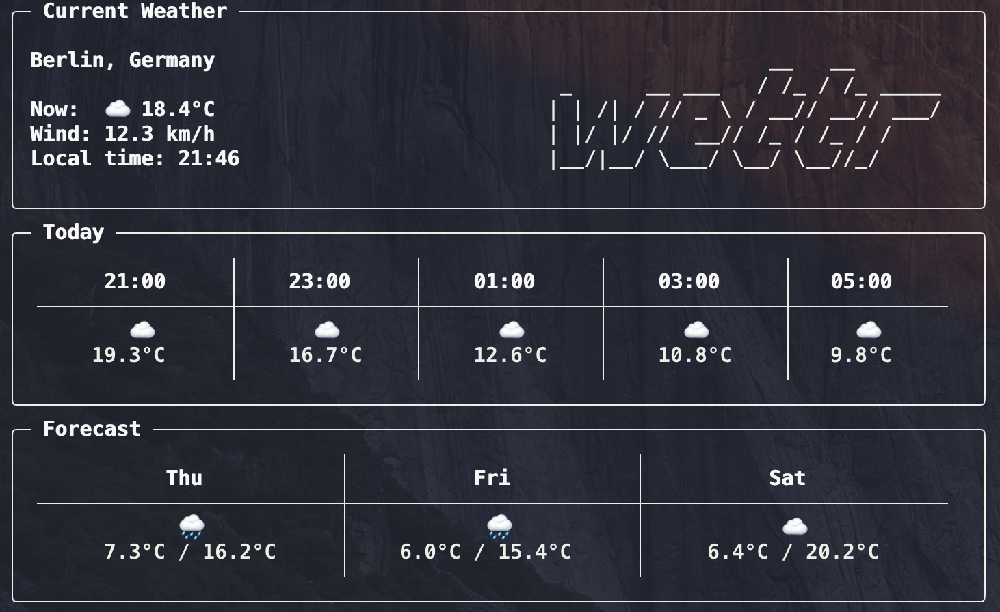

# 🌦️ wettr

A visually appealing and simple command-line weather app built in Python using the [Open-Meteo API](https://open-meteo.com/). Displays current, hourly, and 3-day forecasts with emojis.



## ✨ Features

- Current weather (temp, wind, weather condition)
- Hourly forecast (next 8 hours)
- 3-day forecast
- Automatically detects your city (via IP)

## 📦 Installation

You can install with with pip:

```bash
pip install .
wettr --help
```

## 🚀 Usage

```bash
wettr                  # Show forecast for your current location
wettr --city "Berlin"  # Show forecast for Berlin
wettr --f              # Show temps in °F
```